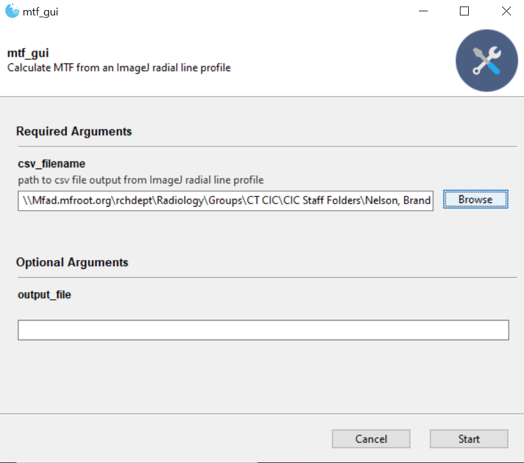

# XRI MTF tool

The XRI MTF tool is a simple MTF measurement tool/protocal using a small python script and leaning heavily on existing functionality in ImageJ


## Installation

The following assumes installations of python and ImageJ

To check if you have a version of python installed, open a command line and type `python`


If you do not get something like above, first download python from: <https://www.python.org/downloads/>

Likewise ImageJ can be downloaded here (Fiji is just ImageJ and is the recommended fully-loaded ImageJ): <https://imagej.net/software/fiji/downloads>

### Install instructions for basic command line usage

1. Copy the files to your local computer:
   - **Preferred:** Using git: `git clone https://rohaslrailgit.mayo.edu/ctcic/mct-developement/xri-mtf.git`
   - If you prefer not to use git or don't have it installed you can also code to the code site: <https://rohaslrailgit.mayo.edu/ctcic/mct-developement/xri-mtf> and find the download button to download everything as a zip folder. Once you unzip it you can proceed with the rest of the install.


2. change the working directory to be in the program folder
   - `cd xri-mtf`

3. install dependencies
   - `pip install -r requirements.txt`

4. test run:

   - `python mtf_gui.py`

The following window should appear:


###  (optional) If you want an executable shortcut

3. Run pyinstaller:  `pyinstaller mtf_gui.py`

This should take 1-2 minutes to complete....

4. Create a shortcut to the executable

Once pyinstaller finishes, in your file explorer, inside the program folder ("xri-mtf") navigate to `/dist/mtf_gui/` and inside you will find `mtf_gui.exe`

right click on it and select `create shortcut`, you can then move this shortcut to your desktop or any convenient location to call the program from.


## Usage

The program assumes `csv` files in the format produced by ImageJ which is a 2 columns CSV, where the first column contains the distances and the second contains gray values from the line profile.

Sample profiles have been provided in the `profiles` directory to experiment with.

### Calibrating Pixel Scale

If you want the MTF results in proper units the image must have a spatial calibration, i.e the pixel sizes are known. (Note this is done automatically in the Bruker and NSI recons). However if the spatial scale is not set you'll need to do this manually. There are lots of simple tutorials online for how to do this, here's one: <https://microscopy.berkeley.edu/courses/dib/sections/04IPIII/IJsetscale.html>

- If pixels are already calibrated you can skip this step

### Measuring Edge Spread Profiles

The simplest MTF measurement starts with an edge profile from a single line ROI as shown below (note the <ctrl>+<k> keyboard shortcut to quickly grab a line profile from a line ROI). This will pull up a plot of the profile.


Save the profile using the `Data` --> `Save Data...` window, note the default output is csv.


In this example I saved out a file called `edge_profile.csv` to the current directory.

### Command line usage

- The MTF tool works both from the command line as well as from a graphical program. The command line program works as follows: Starting in the program directory run: `python my_edge_profile.csv`, where you can replace the csv filename with your own.

Without any other arguments the MTF values will be output straight to the terminal


#### Saving to csv file

You can also save the results to csv format with the following:

```cmd
python mtf.py my_edge_profile.csv -o mtf.csv
```

Note the `-o` flag is short for "output filename"

### Graphical user interface

The graphical program can be started either by double-clicking on the executable shortcut or opened from the command line via:

```cmd
python mtf_gui.py
```

Once the program is opened you can select the `Browse` button to navigate to and select a csv file containing an edge profile:



Selecting start will then run the program and output the results to the program window:


You can also specify an output filename (don't forget to have a `.csv` ending) to save the output to.

## Visualizing MTF results

With the MTF csv output you can visualize the result in a variet of ways such as in Excel or even in ImageJ (since you likely still have it open). Since this my preference I will demonstrate ImageJ usage below

### with ImageJ plotting

1. Find the output csv file in your file directory then drag and drop it into the ImageJ bar, which will automatically pull it up as a table.
2. Next, right click on the dark gray table header and select `Plot...`, which will automatically pull up the interactive plot shown on the bottom left.

In the ImageJ plotting window you can highlight individual points and adjust the axis limits interactively to better visualize the results.


ImageJ has nice plotting capabilities if you want to compare MTF curves directly from different systems rather than just comparing their 10% cutoff value.


Note: the red curve is edge-enhanced so it has an MTF > 1 at a spatial frequency of around 5 lp/mmm.

### Interpreting the MTF curve results

Modulation transfer function (MTF) indicates how well contrast (dark to bright or vice versa) can change for a given spatial frequency where a value of 1.0 is complete transfer (ideal). Using the plot above as an example the low frequencies maintain high MTF, so a bar pattern with a bar pattern frequency of 5 bars per mm (i.e. 5 [1/mm] on the frequency axis) will maintain about 60% of its true contrast while the remainder is lost to blur.

#### Summarizing a system's spatial resolution: the 10% cutoff

While the full curve contains the full spatial response of the imaging system sometimes it is convenient to be able to report a single number as the spatial resolution of the system. For this the 10% MTF cutoff is considered a good approximation of the finest detail that can be reasonably resolved. For the results above you can check either the table readout or the plot to find the spatial frequency where the MTF first dips below 10%, here is ~ 13 [1/mm] or 13 [lp/mm].

To see how this result translates to the smallest resolvable bar pattern we can refer to the [QRM bar pattern table](https://www.qrm.de/en/products/micro-ct-bar-pattern-phantoms/?type=3451&downloadfile=1702&cHash=4896f4ad318a4cd94f022f8b62d25829):


Thus $MTF_{0.1} = 13$ [1/mm] works out to be somewhat better than the 50 um linewidth bar patterns. Thus in the A block the first 3 patterns should be clearly visible, while smaller patterns should be harder to resolve.

#### Other interpretations: Nyquist's theorem

[Nyquist's theorem](https://en.wikipedia.org/wiki/Nyquist%E2%80%93Shannon_sampling_theorem) theorem is commonly used in signal processing to relate the system's sampling rate $f_{sample}$, inversely related to sampling period (e.g. voxel size in CT $\Delta d = 1/f_{sample}$) to the smallest structures it can reasonably detect, $\Delta x$, the size of the structure with max frequency $B = 1/\Delta x$. These are all related by the following:

$\Delta x > 2/f_{sample} = 2*\Delta d$

The scan that I grabbed that image from had a voxel size of $\Delta d = 25 \mu m$, thus using this relation we could estimate the smallest resolvable structures to be about $50 \mu m$.

However we can compare this to our 10% MTF results which empirically tell us what the *actual* smallest structure we can resolve is, by $\Delta x \approx \frac{1}{MTF_{0.1}} = 77 \mu {m}$. This is close to but not exactly our voxel size which gives us our theoretical max resolution. Other factors from the system such as focal spot size, geometry misalignment, reconstruction kernel could cause this additional blurring.

Thus the MTF is a valuable tool to give you real measurements of a system's spatial resolution to compare amongst its theoretical value as well as between systems. It can also be used to compare reconstruction kernels or look for specific frequencies other than $MTF_{0.1}$ that are enhanced.

## References

1. Richard S, Husarik DB, Yadava G, Murphy SN, Samei E. Towards task-based assessment of CT performance: system and object MTF across different reconstruction algorithms. Med Phys. 2012;39(7):4115-4122. https://doi.org/10.1118/1.4725171
